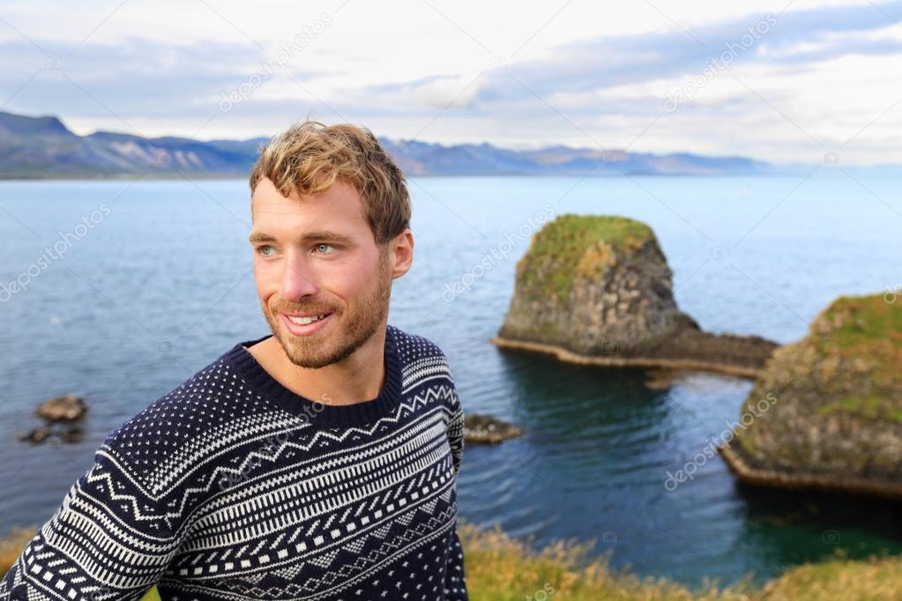
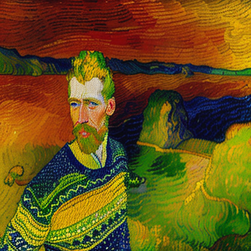

# Van Gough Style Transfer
The Van Gough Style Transfer code is designed to transform photographs/portraits of people into paintings resembling the iconic style of Vincent van Gough. By utilizing stable diffusion, control nets, and tile control net this code generates high-resolution images that emulate the artistic essence of Van Gough's paintings.


## Setting Up
The code should be built and deployed using `cog`. The requirments can be found in `cog.yaml`

To build and test locally run:
`cog predict -i image=<url_to_image>`

To push to a Replicate repo use: 
```
cog login
cog push r8.im/<your-username>/<your-model-name>
```

## How It Works
The code takes an image as an URL and gives as output a high-resolution image, of the same image now in the style of van gough.

We use stable diffusion 1.5 and the follwing four control nets:

`img2img` - for general preservation of the input image  
`canny` - to preserve the edges found in the original image  
`depth` - to preserve the depth of the original portrait  
`pose` - to preserve the pose of the portrait  

We also employ a positive and negative prompt to create the optimal output image.

The strength of each control net can be tuned to give more realistic or more art-looking results.

Lastly we use `tilecontrolnet` to upscale the output image to 1024x1024 pixels, for a high resolution output.

## Example
This particular example is tuned to more heavily be influence by Van Gough's style - but it could be tuned to be more reflective of the input image, depending on the user need.

Original      |  Van Gough   
:-------------------------:|:-------------------------:
  |  

## Next Steps
The results could be greatly improved by tuning the weights of the different control nets, as well as significant efforts in prompt engineering.

